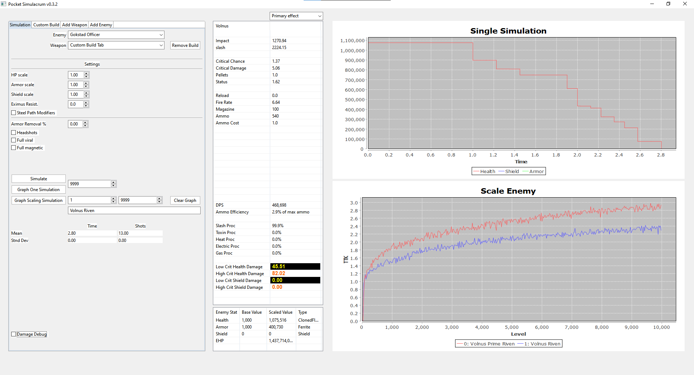
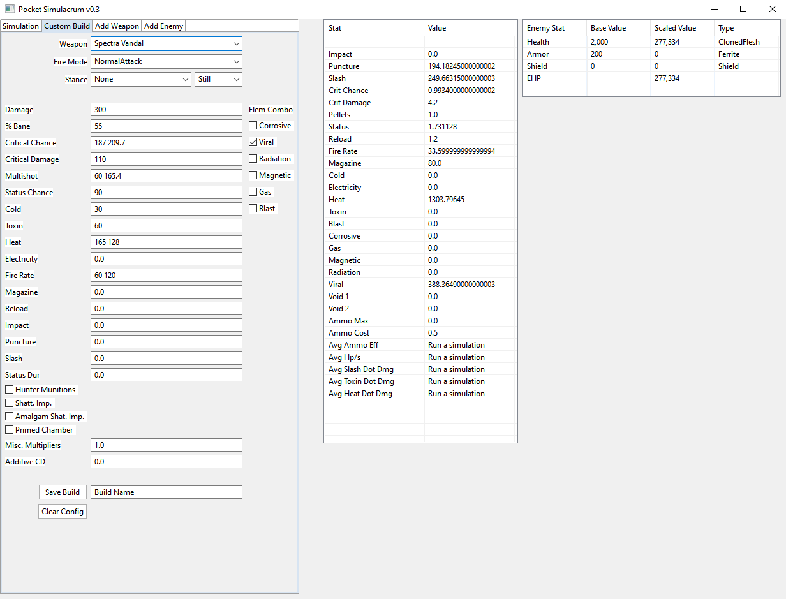
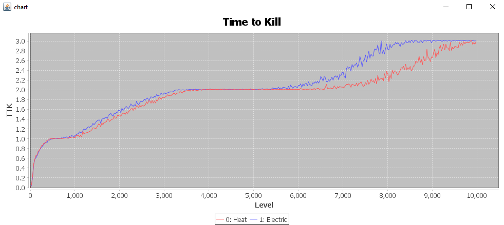

# Pocket Simulacrum
This uses Monte Carlo methods. That means using random sampling, many simulations are averaged to get the result. 

Most things are implemented with the exception of some weapon specific functionality (see below: Things that may not be added, unless largely requested). Melee attack spacing uses the time to complete the moveset divided by the number of hits.

## Todo
~~Major optimizations~~ ~2x faster

-Get weapon info directly from mobile export

-Clean up JSON 

-Make some functionality to display individual damage numbers (for easier bug finding)

-Get build information from Warframe's API

~~Release JAR for easy execution (I have to figure out licensing)~~

## Known issues
-Status duration not fully set up

-DR for toxin damage against shielded demolyst (inconsistent in-game anyways)

## Things that may not be added, unless largely requested
-Spool up weapon functionality

-Beam weapon damage ramp up

## Download

https://github.com/A-DYB/warframe-simulator/releases/

## Imports
JfreeChart download: https://www.jfree.org/jfreechart/download.html
